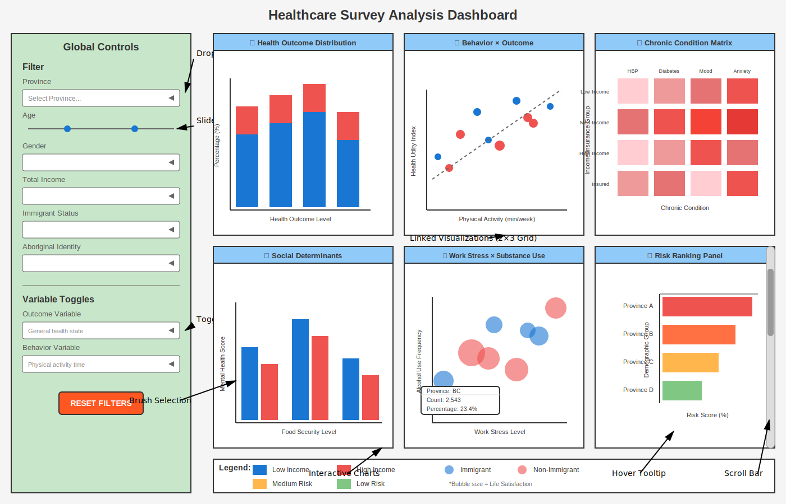

# Healthcare Survey Analysis Dashboard

------------------------------------------------------------------------

## 📊 Project Overview

This project aims to analyze and visualize the Healthcare Survey Dataset to uncover insights regarding public health trends, mental health states, and lifestyle factors. Our team is developing an interactive dashboard to make these complex data relationships accessible and actionable for health researchers and policymakers.

------------------------------------------------------------------------

## Dataset Source:

Kaggle - Healthcare Survey <https://www.kaggle.com/datasets/aradhanahirapara/healthcare-survey>

------------------------------------------------------------------------

## 👥 Group Members

Xuanrui Qiu (Harry)

Inaara Rajwani

Yin-Wen Tsai (Ella)

Sage Yang

------------------------------------------------------------------------

## 📝 Important Project Notes

------------------------------------------------------------------------

## 📱 Description of App & Sketch

This dashboard is designed as an interactive health equity exploration tool based on a national healthcare survey dataset. The app presents a single-page interface with a left-hand filter panel and a main visualization area containing six coordinated plot panels arranged in a 2×3 grid.

The sidebar allows users to filter the dataset by province, age range, gender, income bracket, immigrant status, and Indigenous identity. Additional toggle controls allow users to switch between key outcome variables (e.g., general health, mental health, stress level, health utility index) and behavior variables (e.g., physical activity, diet, work hours). All filters dynamically update the visualizations.

The main panel includes: - a stacked bar chart showing the distribution of health outcomes across demographic groups; - a scatter plot exploring relationships between health behaviors and outcomes; - a heatmap showing chronic condition prevalence across socioeconomic groups; - a grouped bar chart illustrating social determinants such as food security and sense of belonging; - a bubble chart examining work stress and substance use interactions; and - a ranking panel highlighting high-risk demographic groups.

All plots support hover tooltips and coordinated filtering, allowing users to explore patterns and disparities interactively. The design balances analytical depth with realistic implementation scope while addressing the core research questions on health inequity.

------------------------------------------------------------------------

## 🚀 Milestone Roadmap

Milestone 1: Finalize scenario, dataset, target audience, and dashboard sketch.

Milestone 2: Create and deploy a functional prototype dashboard in Python.

Milestone 3: Design a user feedback survey and conduct experience testing.

Milestone 4: Implement feedback and finalize the production-ready dashboard.
